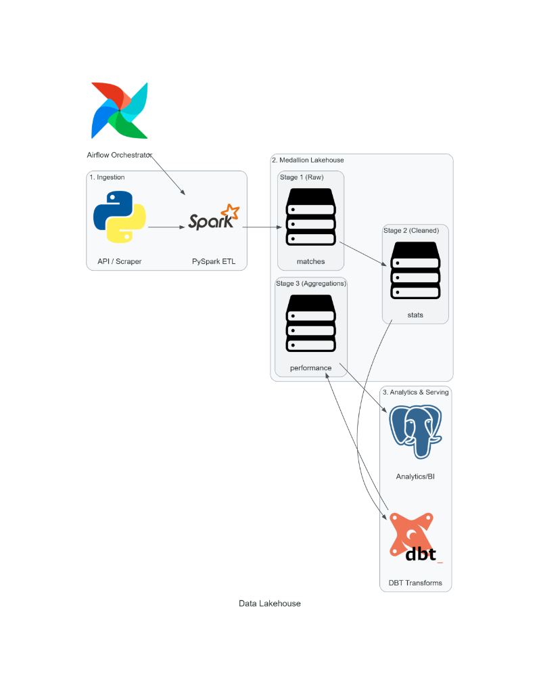

# Real Madrid Team Data Lakehouse

A Data Lakehouse engineered to ingest, process, conform, and serve match and player performance analytics for Real Madrid C.F. Built with PySpark, Delta Lake, dbt, and Apache Airflow, this repository implements a decoupled, stage-based medallion architecture replacing traditional, rigid relational ETL pipelines.

## Table of Contents

- [Project Overview](#project-overview)
- [System Architecture](#system-architecture)
- [Medallion Storage Stages](#medallion-storage-stages)
- [Repository Layout](#repository-layout)
- [Tech Stack](#tech-stack)
- [Getting Started](#getting-started)
  - [Prerequisites](#prerequisites)
  - [Local Installation](#local-installation)
- [CI/CD and Code Quality](#cicd-and-code-quality)
- [Data Modeling and Metrics](#data-modeling-and-metrics)
- [Roadmap](#roadmap)
- [License](#license)

---

## Project Overview

Tracking modern football analytics at club scale requires processing high-volume event streams (progressive actions, expected metrics, defensive recoveries, and positional coordinates). Traditional relational databases struggle with schema fluctuations and lack table versioning, while flat data lakes lack ACID transactions.

This platform bridges both paradigms:
- **Decoupled Architecture:** Scalable columnar Delta tables on local or cloud object storage.
- **ACID Guarantees and Time Travel:** Atomic `MERGE INTO` operations prevent duplicate match logs on retries.
- **Tailored Scoping:** Conforms match logs specifically scoped to Real Madrid fixtures across La Liga and UEFA Champions League competitions.

---

## System Architecture

The pipeline automates data movement from external football data providers through a three-stage Lakehouse model to serving endpoints.

<p align="center">
  
</p>

- **Orchestrator (Airflow):** Manages job triggers, API quotas, dependency trees, and backoff retries.
- **Ingestion Engine (PySpark ETL):** Extracts payloads from external REST endpoints, stamps ingestion metadata, and writes immutable Delta snapshots.
- **Storage Engine (Medallion Lakehouse):** Organizes storage into Stage 1, Stage 2, and Stage 3 with strict schema validation.
- **Transformations (dbt):** Executes in-lake SQL transformations to build star-schema models and pre-computed tactical aggregates.
- **Serving and BI (PostgreSQL / Dashboards):** Exposes optimized performance tables to tactical dashboards and machine learning models.

---

## Medallion Storage Stages

| Stage | Target Path | Format | Description and Scope |
| :--- | :--- | :--- | :--- |
| **Stage 1 (Raw)** | `data/stage1/matches`<br>`data/stage1/players` | JSON | **Immutable Landing Zone:** Unaltered match and player event JSON dumps fetched from Understat API. |
| **Stage 2 (Cleaned)** | `data/stage2/dim_matches`<br>`data/stage2/fct_player_stats` | Delta Lake | **Conformed Layer:** Filtered specifically for Real Madrid fixtures, schema-cast columns, per-90 metrics, and partitioned by `season`. |
| **Stage 3 (Aggregations)** | `data/stage3/fct_rma_performance`<br>`data/stage3/agg_rma_player_p90` | Delta Lake | **Analytical Serving:** 5-match rolling form (points, xG, $\Delta\text{xG}$), finishing efficiency ($\Delta\text{xG}$, $\Delta\text{xA}$), shot conversion %, and goal involvement per 90. |

---

## Repository Layout

```text
football_r1/
├── .github/
│   └── workflows/
│       ├── ci.yml               # Linting, style checks and PySpark test suite
│       └── docker-build.yml     # Docker build smoke test
├── data/                        # Lakehouse Storage
│   ├── stage1/                  # Raw landing tables (matches, player logs)
│   ├── stage2/                  # Cleaned and conformed dimensional tables
│   └── stage3/                  # Aggregated metrics and tactical tables
├── docker/
│   ├── Dockerfile.spark         # Containerized Spark runtime
│   └── docker-compose.yml       # Local orchestration stack
├── docs/
│   └── architecture_diagram.png # Architecture diagram image
├── src/
│   ├── __init__.py
│   ├── ingestion/               # API extraction scripts and clients
│   ├── transformation/          # Stage 1 -> Stage 2 -> Stage 3 ETL logic
│   └── utils/                   # SparkSession helpers and Delta configurations
├── tests/
│   ├── __init__.py
│   ├── integration/             # Pipeline execution tests
│   └── unit/                    # Metric computations and schema checks
├── pyproject.toml               # Ruff and Pytest configuration
├── requirements.txt             # Core runtime dependencies
├── requirements-dev.txt         # Testing and linting tools
└── README.md
```

---

## Tech Stack

| Domain | Technology | Purpose |
| :--- | :--- | :--- |
| **Distributed Compute** | Apache Spark (PySpark 3.5) | Scalable distributed processing engine |
| **Lake Storage Format** | Delta Lake 3.2 | ACID transactions, unified batch processing, time-travel |
| **Orchestration** | Apache Airflow | Directed Acyclic Graph (DAG) scheduling and workflow monitoring |
| **Transformations** | dbt (Data Build Tool) | Modular SQL transformations, testing, and documentation |
| **Serving and Storage** | PostgreSQL / BI Connectors | Relational serving layer for dashboards and tactical tooling |
| **Code Quality** | Ruff and Pytest | High-performance linting and automated pipeline unit tests |
| **CI/CD** | GitHub Actions | Automated linting, test runners, and container verification |

---

## Getting Started

### Prerequisites

- **Python**: 3.10 or 3.11
- **Java**: OpenJDK 17 (Required for running PySpark execution engines locally)
- **Docker and Docker Compose** (Optional, for containerized execution)

### Local Installation

1. Clone the repository:
   ```bash
   git clone https://github.com/<your-username>/football_r1.git
   cd football_r1
   ```

2. Create and activate a virtual environment:
   - **Windows (PowerShell):**
     ```powershell
     python -m venv .venv
     .venv\Scripts\Activate.ps1
     ```
   - **Linux / macOS:**
     ```bash
     python3 -m venv .venv
     source .venv/bin/activate
     ```

3. Install dependencies:
   ```bash
   pip install --upgrade pip
   pip install -r requirements.txt
   pip install -r requirements-dev.txt
   ```

4. Add the architecture diagram: Place your architecture diagram image into the docs folder:
   ```text
   docs/architecture_diagram.png
   ```

5. Run the pipeline stages:
   ```bash
   # Stage 1: Ingest raw matches and player logs
   python src/ingestion/fetch_understat.py

   # Stage 2: Transform raw JSON into Stage 2 Delta tables
   python src/transformation/delta_table_transform.py

   # Stage 3: Compute Stage 3 analytical performance tables
   python src/transformation/relational_database_create.py
   ```

---

## CI/CD and Code Quality

This repository enforces strict code style, typing, and test execution on every pull request via GitHub Actions.

### Run Code Linter and Formatter

```bash
# Check for lint errors
ruff check .

# Check formatting
ruff format --check .

# Auto-fix formatting
ruff format .
```

### Run Test Suite

```bash
pytest tests/ -v
```

---

## Data Modeling and Metrics

### Analytical Equations Computed in Stage 3

**Normalized Metric per 90 Minutes:**

$$
\text{Metric}_{90} = \left( \frac{\text{Total Event Count}}{\text{Minutes Played}} \right) \times 90
$$

**Expected Goals Difference ($\Delta\text{xG}$):**

$$
\Delta\text{xG} = \text{xG}_{\text{for}} - \text{xG}_{\text{against}}
$$

**Player Finishing Differential:**

$$
\text{Finishing Differential} = \text{Goals} - \text{xG}
$$

**Shot Conversion Percentage:**

$$
\text{Shot Conversion \%} = \left( \frac{\text{Goals}}{\text{Shots}} \right) \times 100
$$

**Goal Involvement per 90:**

$$
\text{Goal Involvement}_{90} = \text{Goals}_{90} + \text{xA}_{90}
$$

**Field Tilt Percentage:**

$$
\text{Field Tilt} = \left( \frac{\text{Final Third Passes}_{\text{Real Madrid}}}{\text{Final Third Passes}_{\text{Total}}} \right) \times 100
$$

## Roadmap

- [x] Initial repository structure and CI/CD workflow configuration
- [x] Stage-based lakehouse storage schema definition
- [x] API extraction client for Understat match and player payloads (Stage 1)
- [x] Stage 1 to Stage 2 PySpark cleaning and Real Madrid filter logic
- [x] Stage 2 to Stage 3 analytical metrics and rolling trends (fct_rma_performance, agg_rma_player_p90)
- [ ] Airflow DAG configuration for match-day automated runs
- [ ] PowerBI / Streamlit dashboard serving integration

---

## License
Distributed under the MIT License. See `LICENSE` for more information.